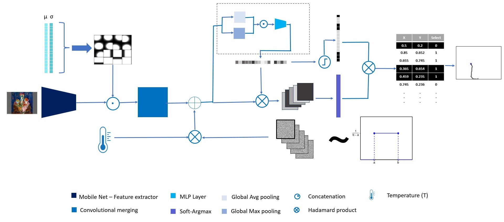
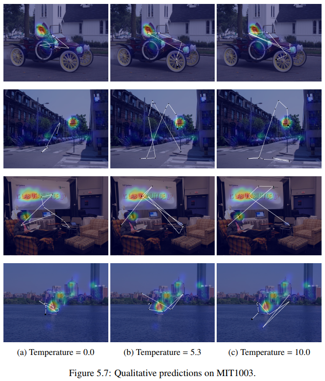
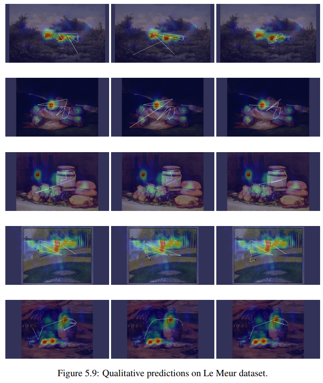
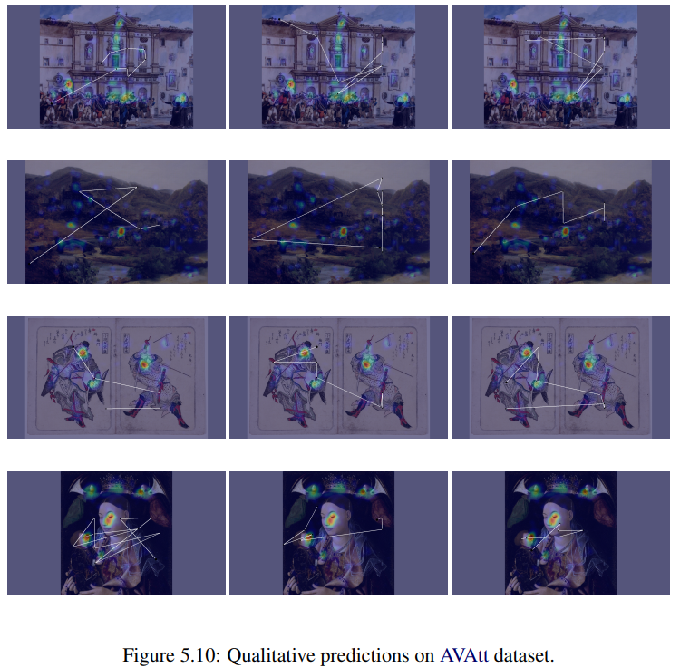

# SPGEn

---


[](https://arxiv.org/abs/2209.11338)
----

## Abstract 
Cultural heritage plays a pivotal role in shaping societal identity, especially in the modern era of globalization. Preserving and understanding this rich legacy is of paramount importance. Among the vital components of cultural heritage, paintings hold a prominent position and have been subject to continuous and comprehensive research. The study of viewers' perceptual and cognitive behavior is intricately intertwined with the properties of the Human Visual System (HSV). In this paper, we investigate the eye movement patterns of viewers during their visual engagement with various paintings and propose a cutting-edge deep learning methodology for their modernization.

Our novel approach is designed to predict human visual attention, a crucial aspect influencing diverse human cognitive processes, including the fundamental comprehension of natural scenes. More specifically our proposed approach predicts the sequence of fixation points that define the gaze trajectory called a scanpath.  We extend this methodology to painting images, unraveling the complexities of viewer attention within this specific artistic context.

The core of our proposed architecture relies on a Fully Convolutional Neural Network (FCNN), incorporating innovative differentiable fixation selection and Soft-Argmax modules. Additionally, we integrate learnable Gaussian distributions into the network bottleneck, simulating the inherent bias in the visual attention process associated with natural scene images. We introduce an unsupervised learning mechanism using a gradient reversal classifier to address domain shifts arising from differences between natural images and paintings. This enables the model to learn general characteristics from other domains and adapt to the unique visual aspects of paintings.

Given the stochastic and subjective nature of gaze scanpaths, we introduce a  random noise sampler operating on the latent space of the representations. This effectively manages the model's variability, controlled by a temperature parameter that modulates the strength of the noise.

Extensive testing of our model demonstrates its superiority over existing state-of-the-art methods, achieving outstanding results across multiple datasets and various types of evaluation metrics including vector-based and hybrid ones. Our deep learning approach significantly advances the understanding of human visual attention in the context of cultural heritage, paving the way for enhanced preservation and appreciation of these valuable artistic treasures.

## Model 



## Reuslts
### MIT1003 Dataset
 

### Le Meur Painting Dataset
 

### AVAtt Painting Dataset (Ours)
 

```bibtex
@inproceedings{10.1145/3549555.3549597,
author = {Kerkouri, Mohamed Amine and Tliba, Marouane and Chetouani, Aladine and Bruno, Alessandro},
title = {A domain adaptive deep learning solution for scanpath prediction of paintings},
year = {2022},
isbn = {9781450397209},
publisher = {Association for Computing Machinery},
address = {New York, NY, USA},
url = {https://doi.org/10.1145/3549555.3549597},
doi = {10.1145/3549555.3549597},
booktitle = {Proceedings of the 19th International Conference on Content-Based Multimedia Indexing},
pages = {57–63},
numpages = {7},
keywords = {Paintings., Scanpath Prediction, Unsupervised Domain Adaptation},
location = {Graz, Austria},
series = {CBMI '22}
}
```

# Intructions 

